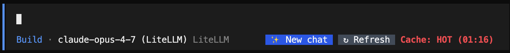
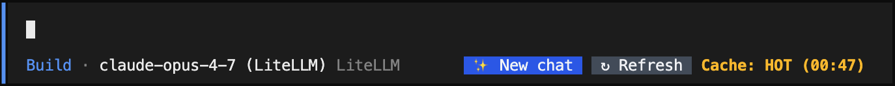
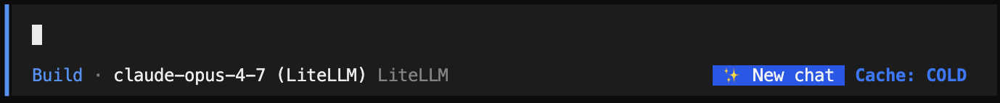
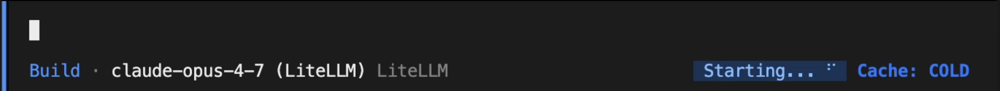
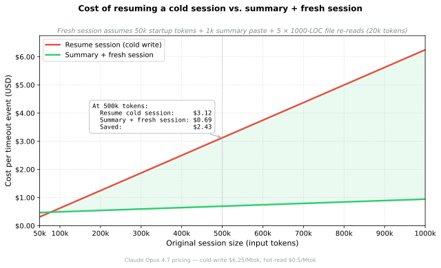

<div align="center">
  <h1 align="center">cache-timer ⚡🕒</h1>

  <p align="center">
    <strong>Live prompt-cache countdown and pre-emptive cache-saving for <a href="https://opencode.ai">OpenCode</a></strong>
  </p>

  <p align="center">
    <a href="https://www.npmjs.com/package/cache-timer">
      
    </a>
    <a href="./CHANGELOG.md">
      
    </a>
    <a href="./LICENSE">
      
    </a>
  </p>

  <p align="center">
    <a href="#what-is-it">What is it?</a> •
    <a href="#-quick-start">Quick Start</a> •
    <a href="#configuration">Configuration</a> •
    <a href="./CHANGELOG.md">Changelog</a>
  </p>
</div>

---

## What is it?

A TUI plugin that shows a live countdown to your prompt-cache expiry in the OpenCode session bar.

The countdown indicator and two clickable buttons sit on the right side of your prompt:

- 🔥 **Cache: HOT (05:00)** — healthy, time remaining. Both **✨ New chat** and **↻ Refresh** buttons available.
- ⚠️ **Cache: HOT (00:59)** — under one minute, about to expire. Both buttons still available.
- ❄️ **Cache: COLD** — expired or model changed. **↻ Refresh** is hidden (clicking it would pay the full cold-cache tax); **✨ New chat** stays.
- ⏳ **Starting...** — animated spinner shown while a new chat is being seeded and the TUI navigates to it.

<p align="center">
  
</p>
<p align="center">
  
</p>
<p align="center">
  
</p>
<p align="center">
  
</p>

When your session is COLD, you have three choices:

1. **Pay the cold-start tax** to continue your session, or
2. **Start a new session** and rebuild context — one click on **✨ New chat**.
3. **Drop the session entirely**. Move on. Might not be worth continuing this session at all.

* On **cost**, starting fresh almost always wins — especially over 100k input tokens (see chart).
* On **latency**, resuming wins — one up-front cold-write hit beats several `Read` round-trips in a fresh session. Worth paying if you're coming back to do one quick thing and don't need to maximize savings.

**✨ New chat** automates choice #2: it spins up a brand-new session seeded with a tiny continuation prompt (last user message, last assistant reply, and up to 5 most-recently `read` file paths) and auto-navigates the TUI to it. Inherits the source session's model. **↻ Refresh** sends a no-op prompt to the current session to keep the cache hot; it's hidden once the cache goes COLD because clicking it then would pay the full cold-write tax — the exact action this plugin exists to prevent.

The plugin also **optionally** helps make it easier to start a fresh session (off by default — see [Configuration](#configuration) to enable). If enabled, it fires a tiny "summarize progress" prompt 15 seconds before the cache goes cold, capturing a hot-read summary you can paste into a fresh session to skip the cold-start write tax of resuming the bloated original.

## Why this exists

When a 500k-token session goes cold, just *resuming* it costs **$3.12** in cold-write fees before you've done any new work. The auto-summary path — hot-read the existing context to produce a summary, paste it into a fresh session — costs **$0.69** under realistic assumptions (50k startup tokens, 1k summary paste, 5 file re-reads at 1000 LOC each). **Savings of ~$2.43 per timeout you would have otherwise resumed,** scaling linearly with session size:

<p align="center">
  
</p>

> **When resume actually wins:** rarely on cost — you'd need to re-read essentially the entire original session in the fresh one for the math to flip, which almost never happens. The real argument for resuming is **latency**: a cold-write is a single up-front wall-clock hit, while a fresh session can spend the first several turns making `Read` calls to rebuild context the original already had. If you're coming back to do one quick thing and want to start immediately, just pay the tax if you can afford the extra cost.

> **The auto-summary is OFF by default.** It requires explicit opt-in so the plugin never spends your tokens without permission. See [Configuration](#configuration) to enable it.

## 🚀 Quick Start

Add the package to the `plugin` array in your `opencode.json`:

```json
{
  "$schema": "https://opencode.ai/config.json",
  "plugin": ["cache-timer"]
}
```

OpenCode auto-installs npm plugins via Bun at startup. Restart OpenCode and you should see a green "Cache Timer loaded" toast.

## Configuration

The visual countdown works out of the box with no configuration. To enable the auto-summary, create `~/.config/opencode/cache-timer.json`:

```json
{
  "enableAutoPrompt": true,
  "durations": {
    "claude": 300,
    "gemini": 300,
    "gpt": 300
  }
}
```

| Field              | Type    | Default                                       | Notes                                                                  |
| ------------------ | ------- | --------------------------------------------- | ---------------------------------------------------------------------- |
| `enableAutoPrompt` | boolean | `false`                                       | **Off by default.** Set `true` to send the auto-summary 15s pre-expiry |
| `durations`        | object  | `{ claude: 300, gemini: 300, gpt: 300 }`      | Seconds, keyed by provider family (substring-matched against model id) |
| `defaultDuration`  | number  | `300`                                         | Fallback when the model doesn't match any family                       |

Per-project overrides live at `./.opencode/cache-timer.json` and win field-by-field over the global file. `"claude": 300` covers `claude-opus-4-7`, `claude-haiku-4-5`, `claude-3-5-sonnet`, etc.

<details>
<summary><b>Why a sidecar file instead of <code>opencode.json</code>?</b></summary>

Opencode's `opencode.json` validates against a strict JSON schema with `additionalProperties: false` at the top level, so an inline `cacheTimer: { ... }` block would prevent opencode from starting. The documented `["file://path", { ...options }]` plugin-tuple form does not forward options to TUI plugins in released opencode (verified against v1.15.x; an empirical survey of nine ecosystem plugins found that zero of them use that mechanism). Sidecar JSON files are the de-facto idiomatic pattern, used by `opencode-dcp`, `opencode-vibeguard`, `opencode-sentry-monitor`, and `opencode-notificator`.

</details>

## 🛠️ Building from Source

```bash
npm install
npm run build   # compiles cache-timer.tsx -> tui.js
```

---

<div align="center">
  <p>
    <a href="https://github.com/ncejda-g2/opencode-cache-timer/issues">Report Bug</a> •
    <a href="https://github.com/ncejda-g2/opencode-cache-timer/issues">Request Feature</a>
  </p>
</div>
